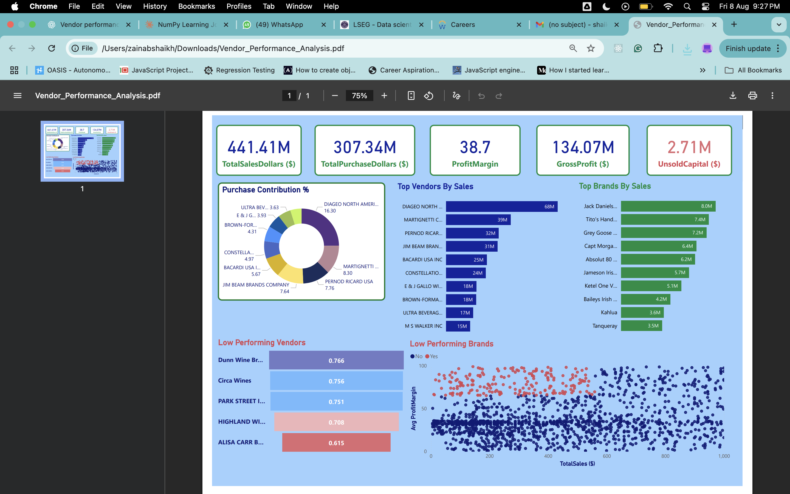
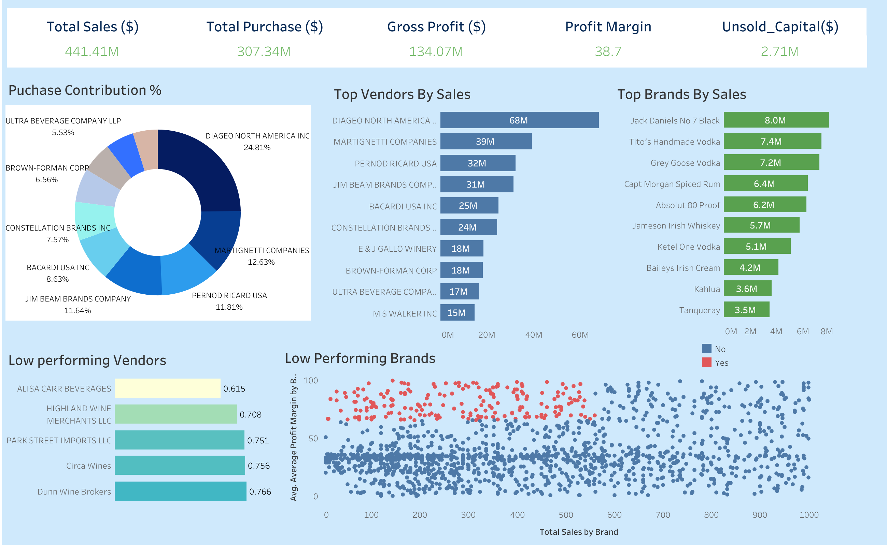

# 📦 Vendor Performance Analysis - Retail Inventory & Sales

Analyzing vendor efficiency and profitability to support strategic purchasing and inventory decisions using **SQL**, **Python**,**Tableau** and **Power BI**.

---

## 📚 Table of Contents

- [📌 Overview](#-overview)
- [💼 Business Problem](#-business-problem)
- [📂 Dataset](#-dataset)
- [🛠️ Tools & Technologies](#-tools--technologies)
- [📁 Project Structure](#-project-structure)
- [🧹 Data Cleaning & Preparation](#-data-cleaning--preparation)
- [📊 Exploratory Data Analysis (EDA)](#-exploratory-data-analysis-eda)
- [🔍 Research Questions & Key Findings](#-research-questions--key-findings)
- [📈 Dashboard](#-dashboard)
- [⚙️ How to Run This Project](#️-how-to-run-this-project)
- [✅ Final Recommendations](#-final-recommendations)

---

## 📌 Overview

This project evaluates vendor performance and retail inventory dynamics to drive strategic insights for purchasing, pricing, and inventory optimization. A complete data pipeline was built using:

- **SQL** for data extraction and transformation
- **Python** for cleaning, analysis, and statistical testing
- **Power BI**,**Tableau** for interactive dashboards

---

## 💼 Business Problem

Effective inventory and sales management are critical in the retail sector. This project aims to:

- Identify underperforming brands needing pricing or promotional adjustments
- Determine vendor contributions to sales and profits
- Analyze the cost-benefit of bulk purchasing
- Investigate inventory turnover inefficiencies
- Statistically validate differences in vendor profitability

---

## 📂 Dataset

- Multiple CSV files located in the `/data/` folder
  - Includes: `sales`, `vendors`, `inventory`, `invoices`, `purchase prices`
- Summary tables created using SQL and used for deeper analysis

---

## 🛠️ Tools & Technologies

| Tool                               | Usage                                          |
| ---------------------------------- | ---------------------------------------------- |
| SQL                                | Data ingestion, joins, filtering, CTEs         |
| Python                             | Data cleaning, EDA, hypothesis testing         |
| Power BI, Tableau                  | Interactive dashboards and visual storytelling |
| GitHub                             | Version control and collaboration              |
| Jupyter                            | Notebooks for EDA and modeling                 |
| Pandas, Seaborn, Matplotlib, SciPy | Data wrangling and visualization               |

---

## 📁 Project Structure

```plaintext
vendor-performance-analysis/
├── data/                               # Raw CSV data files link
├── dashboard/
│   └── vendor_performance_dashboard.pbix
│   └── vendor_performance_dashboard.twbx
├── notebooks/
│   ├── exploratory_data_analysis.ipynb
│   └── vendor_performance_analysis.ipynb
├── scripts/
│   ├── ingestion_db.py
│   └── get_vendor_summary.py
├── output/
│   └── Vendor Performance Report.pdf
├── .gitignore
├── requirements.txt
└── README.md
```

## 🧹 Data Cleaning & Preparation

- Removed transactions with:
- Gross Profit 30
- Profit Margin $ 0
- Sales Quantity = 0
- Created
  summary tables with vendor-level metrics
- Converted data types, handled outliers, merged lookup tables

## Exploratory Data Analysis (EDA)

**Negative or Zero Values Detected:**

- Gross Profit: Min -52,002.78 (loss-making sales)
- Profit Margin: Min # (sales at zero or below cost)
- Unsold Inventory: Indicating slow-moving stock

**Outliers Identified:**

- High Freight Costs (up to 257K)
- Large Purchase/Actual Prices

  **Correlation Analysis:**

- Weak between Purchase Price & Profit
- Strong between Purchase Qty & Sales Qty (0.999)
- Negative between Profit Margin & Sales Price (-0.179)

## 🔎 Research Questions & Key Findings

1. **Brands for Promotions**:
   brands with low sales but high profit margins
2. **Top Vendors**: Top 10 vendors
   = 65.69% of purchases risk of over-reliance
3. **Bulk Purchasing Impact**: 72% cost savings per it in large orders
4. **Inventory Turnover**: $2.71M worth of unsold inventory
5. **Vendor Profitability**:

- High Vendors: Mean Margin = 31.17%
- Low Vendors: Mean Margin = 41.55%

6. **Hypothesis Testing**: Statistically significant difference in profit margins distinct vendor strategies

---

## 📊 Dashboard

- Tableau and Power BI Dashboard shows:
- Vendor-wise Sales and Margins
- Inventory Turnover
- Bulk Purchase Savings
- Performance Heatmaps

### Power BI Dashboard



### Tableau Dashboard



## ⚙️ How to Run This Project

1. Clone the repository:

```bash
   git clone https://github.com/zainab-sk/vendor-performance-analysis-sql-python-tableau-powerbi.git
```

2. Load the CVs and ingest into database:

```bash
   python scripts/ingestion_db.py
```

3. Create vendor summary table:

```bash
   python scripts/get_vendor_summary.py
```

4. Open and run notebooks:

- `notebooks/exploratory_data_analysis.ipynb`
- `notebooks/vendor_performance_analysis.ipynb`

5. Open Tableau or PowerBi Dashboard:

- `dashboard/vendor_performance_dashboard.twbx`
- `dashboard/vendor_performance_dashboard.pbix`

---

## ✅ Final Recommendations

- Diversify vendor base to reduce risk
- Optimize bulk order strategies
- Reprice slow-moving, high-margin brands
- Clear unsold inventory strategically
- Improve marketing for underperforming vendors

## Author & Contact

**Zainab Shaikh** <br>
Data Analyst <br>
✉️ Email: zainab.sd03@gmail.com<br>
🔗 [LinkedIn] (https://www.linkedin.com/in/zainab-shaikh-19o3/)<br>
🔗 [Portfolio] (https://zainabskportfolio.netlify.app/)
